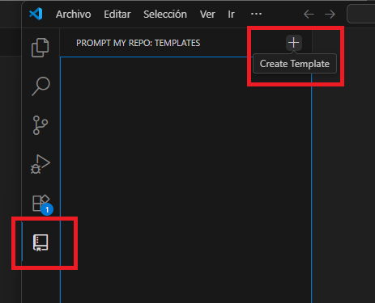
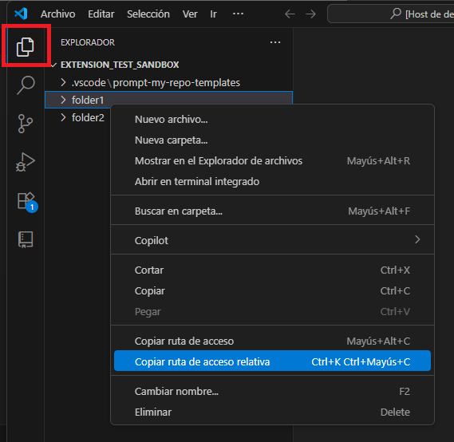
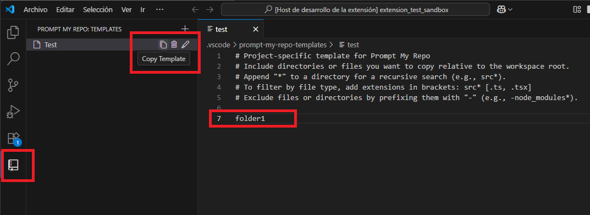
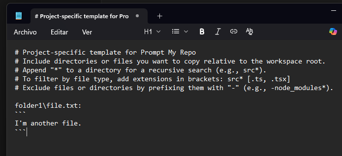

# Prompt My Repo VSCode extension

Welcome to **Prompt My Repo**, a VS Code extension designed to help you easily copy the content of multiple files and directories from your project into a text format. This is particularly useful when working with Large Language Models (LLMs) for code analysis, debugging, or documentation generation.

**[Install the Extension from the Visual Studio Code Marketplace](https://marketplace.visualstudio.com/items?itemName=netraular.prompt-my-repo)**

## How to Use

1.  **Create a New Template**
    Click the `+` icon in the "Prompt My Repo" view sidebar to create a new template file. You will be prompted to give it a name.

    

2.  **Add Paths to Your Template**
    Open your new template file. A quick way to get accurate paths is to right-click any file or folder in the Explorer, select `Copy Relative Path`, and paste it into your template. You can then add modifiers like `*` for recursion or `-` to exclude items.

    

3.  **Process Template and Copy to Clipboard**
    Once your template is defined, right-click on it in the sidebar and select "Copy Template" (or use the inline copy icon). This action reads all the rules in your template, gathers the content from the specified files, and copies the final formatted text to your clipboard.

    

4.  **Paste into Your Prompt**
    Paste the formatted output directly into your LLM chat, a document, or anywhere you need it. The content is structured with file paths for clear context.

    

## Features

- **Select Files and Directories**: Specify files or directories in a template file to include their content.
- **Recursive Directory Search**: Use `*` at the end of a directory path to include all files in subdirectories.
- **Filter by File Extension**: Specify allowed file extensions for directory searches.
- **Exclusions**: Exclude specific files or directories by prefixing them with `-`.
- **Ignore Comments**: Lines starting with `#` are treated as comments and ignored during processing, but they are preserved in the final output to add context to your prompt.
- **Formatted Output**: Copies file content in a structured format, including relative paths and file content.
- **Clipboard Integration**: Automatically copies the formatted output to your clipboard for easy pasting.

## Requirements

- **VS Code**: This extension requires Visual Studio Code version 1.96.0 or higher.
- **Workspace**: You must have an open workspace folder in VS Code.

## Known Issues

- **Large Files**: Extremely large files may cause performance issues when copying content.
- **Non-Text Files**: Binary or non-text files are not supported and will be skipped.

---

## Following Extension Guidelines

This extension adheres to the [VS Code Extension Guidelines](https://code.visualstudio.com/api/references/extension-guidelines). It follows best practices for performance, usability, and maintainability.

**Enjoy using Prompt My Repo!**